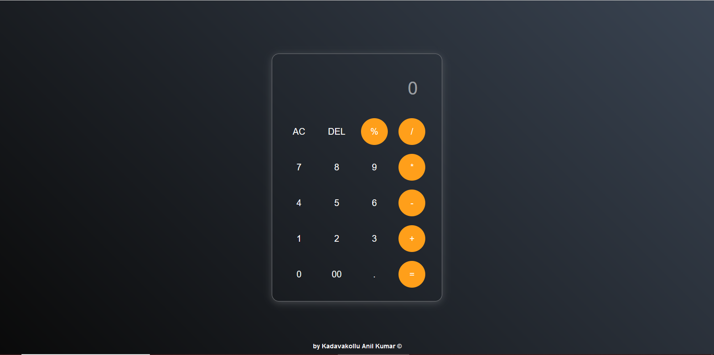

# Calculator
A simple Calculator Program that supports arithmetic operations.

--> Tech-Stack - The programming Languages used in this project are "HTML" "CSS" "Java Script"

Here’s a screenshot of the project:  

  

--> You can clone this repositary

git clone https://github.com/Anilkumarkadavakollu6/Calculator/tree/main
